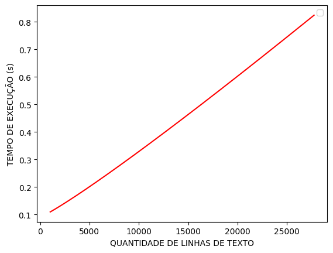

# Auxiliar de Redação

# OBJETIVOS

Foi proposto pelo Prof. Me. Michel Pires da Silva na disciplina de Algoritmo e Estrutura de Dados I, um trabalho no qual o
objetivo era  criar um programa que atuasse como uma auxiliar de redação.

O programa deve realizar a leitura de três arquivos: um contendo uma lista de _Stop Words_, um com uma lista de expressões e, finalmente,  um arquivo com o texto a ser analisado.

Além disso, será gerado um arquivo de saída apresentando as seguintes informações:
* O número da linha no arquivo fonte onde o parágrafo inicializa e termina;
* O número de sentenças existentes no parágrafo;
* O número de palavras de cada sentença incluindo e descartando as "stop words";
* Cada palavra (não stop word) será listada em ordem alfabética com a frequência de sua ocorrência no texto, indicando
  as linhas do arquivo onde essas surgem.
    * Caso a palavra apareça mais de uma vez em um mesmo parágrafo, será indicada sua ocorrência e a distância entre 
  elas, incluindo as stop words.

# INTRODUÇÃO

A redação de textos acadêmicos enfrenta desafios que vão desde a legibilidade até a correção gramatical, ortográfica e a repetição excessiva de palavras. Com o objetivo de aprimorar a qualidade dessas dissertações, este sistema foi desenvolvido como um auxiliar estatístico de redação.

O programa desenvolvido possui a capacidade de analisar arquivos de texto e identificar os parágrafos presentes. Durante o processamento, o sistema realiza a exclusão de palavras comuns, conhecidas como _stop words_. Além disso, ele fornece informações detalhadas sobre cada parágrafo, incluindo o número de sentenças e a contagem total de palavras, considerando tanto as palavras relevantes quanto as consideradas "irrelevantes". Por fim, o sistema gera uma lista em ordem alfabética das expressões essenciais, exibindo a frequência de ocorrência e as linhas correspondentes do arquivo original.

Para o bom desenvolvimento do programa a equipe foi dividida da seguinte forma:

* Anielly Gonçalves, que foi responsável por nomear as funções, estruturar a ideia por trás de cada uma e documentar o software. 
* César Henrique Resende Soares, que foi responsável por fazer as funções responsáveis pela leitura da entrada, stopwords e expressões, documentar o software, executar os testes e medir o desempenho.
* Eduardo Rabelo Guimarães, responsável por desenvolver as funções de output e auxiliar na correção de bugs.
* Emanuel Vieira Tavares, responsável por tratar de toda a parte de acentuação do código, plotar os gráficos dos testes e analisar o mesmo além de também auxiliar na correção de bugs. 
* Vinícius Alves Pereira, responsável por decidir quais as melhores estruturas a serem utilizadas, otimização do código e desenvolvimento das principais funções que processam o texto. 

# ENTRADA

A entrada do programa consiste em três arquivos "ent.txt", "stopwords.txt", "expressoes.txt" que se encontram no diretório "dataset" do projeto.

### ["ent.txt"](./dataset/ent.txt) :

O arquivo utilizado de exemplo para o funcionamento do Auxiliar de Redação contém o texto do livro " A Semana - Machado de Assis" e possui 27763 linhas.


### ["stopwords.txt"](./dataset/stopwords.txt)  :

Esse arquivo contém as palavras que não serão contabilizadas na sentença por não possuírem conteúdo semântico.


### ["expressoes.txt"](./dataset/expressoes.txt)

E o terceiro arquivo de entrada mostra expressões comuns que são muito utilizadas, mas não existem ou deixam o texto confuso ou
pobre devido a sua inclusão.

# LÓGICA E IMPLEMENTAÇÃO
[comment]: <> (Descrição do Michel:
• Um detalhamento mínimo que explique as fases de especificação, projeto e implementação. Nessa etapa, deve-se incluir uma ampla discussão sobre as estruturas utilizadas
e o motivo de sua escolha.)

A implementação do algoritmo foi desenvolvida em C++ e consiste em um programa que processa um texto de entrada em português, realiza análises e gera estatísticas sobre ele. A saída consiste das informações de acordo com as entradas fornecidas, incluindo a frequência de palavras, a localização de palavras em cada parágrafo, sentença e linha, e a ocorrência de expressões específicas.

Para isso, algoritmo usa as bibliotecas padrão do C++ time.h, fstream, iostream, locale, map, set, unordered_map, unordered_set e vector.

Além disso, as estruturas de dados WordInfo, SentenceInfo, ParagraphInfo e ExpressionInfo, que se encontram no arquivo [entities.hpp](./src/entities.hpp) são usadas para armazenar informações sobre palavras, sentenças, parágrafos e expressões encontradas no texto.
## ⚙️ Estruturas:

[comment]: <> (Descrição do Michel:
Um Git contendo todo o projeto, bem como, toda descrição pertinente sobre sua execução, projeto e implementação. Neste documento, espera-se observar também uma
discussão sobre as estruturas adotadas e o motivo de tal decisão.
Para cada algoritmo adotado como parte da solução, uma descrição de seu projeto e análise de complexidade. Essa etapa 
deve ser realizada apenas para algoritmos já existentes e apenas adotados como parte da solução apresentada.)

Em C++, os contêineres são estruturas de dados que fornecem uma maneira conveniente de armazenar e gerenciar coleções de elementos. Esses contêineres são implementados como classes ou estruturas e oferecem várias funcionalidades, como adicionar, remover e pesquisar elementos.
Para o desenvolvimento do trabalho, foram utilizadas as seguintes estruturas para manipular os dados fornecidos com entrada:

* **unordered_map**: é uma estrutura que armazena uma chave e um valor de forma não ordenada por meio de uma tabela 
hash. O **unordered_map** faz parte da biblioteca **STL (Standard Template Library)** e é útil para associar valores a 
chaves e recuperar valores com base em suas chaves.
* **unordered_set**: funciona de forma muito parecida com o **unordered_map**, armazenando valores únicos em ordem 
desordenada. Assim como o **unordered_map**, o **unordered_set** também faz parte da **STL** e é útil para armazenar 
valores únicos e verificar se um valor está presente ou não no conjunto.
* **vector**: essa estrutura foi utilizada por implementar um vetor dinâmico com várias funcionalidades já 
implementadas, facilitando na programação. O vector não é tão custoso e oferece muitas funcionalidades úteis, como 
métodos para inserir, remover e acessar elementos, além de suporte a iteradores e algoritmos da **STL**.
* **set**: foi utilizado graças à sua propriedade de armazenar elementos de um mesmo tipo sem repetição de forma 
ordenada. O **set** é útil quando você precisa armazenar valores únicos em ordem crescente ou decrescente.

<table>

  <tr>
    <th> Estrutura </th>
    <th> Método </th>
    <th> Complexidade </th>
  </tr>

  <tr>
    <td rowspan="4"> string </td>
    <td> find </td>
    <td> No pior caso, linear no tamanho da string </td>
  </tr>

  <tr>
    <td> append </td>
    <td> linear no tamanho da nova string </td>
  </tr>

  <tr>
    <td> insert </td>
    <td> linear no tamanho da nova string </td>
  </tr>

  <tr>
    <td> push_back </td>
    <td> Constante </td>
  </tr>

  <tr>
    <td rowspan="2"> unordered_map </td>
    <td> operator[] </td>
    <td> Na média, constante. Pórem, no pior caso, linear no tamanho do Container</td>
  </tr>

  <tr>
    <td> reserve </td>
    <td> Na média, linear</td>
  </tr>

  <tr>
    <td rowspan="2"> unordered_set </td>
    <td> count </td>
    <td> No pior caso, linear no tamanho da string </td>
  </tr>

  <tr>
    <td> emplace </td>
    <td> Na média, constante. Pórem, no pior caso, linear no tamanho do Container</td>
  </tr>

  <tr>
    <td rowspan="2"> vector </td>
    <td> operator[] </td>
    <td> Constante </td>
  </tr>

  <tr>
    <td> push_back </td>
    <td> Constante </td>
  </tr>

   <tr>
    <td rowspan="1"> set </td>
    <td> emplace </td>
    <td> n*log n </td>
  </tr>

</table>

Descricao da tabela.

Algumas métodos comuns a várias estruturas e seus custos.

<table>
  <tr> 
    <th> Método </th>
    <th> Complexidade </th>
  </tr>

  <tr>
    <td> size </td>
    <td> Constante </td>
  </tr>

  <tr>
    <td> begin </td>
    <td> Constante </td>
  </tr>

  <tr>
    <td> end </td>
    <td> Constante </td>
  </tr>

  <tr>
    <td> empty </td>
    <td> Constante </td>
  </tr>
</table>


## ✏️ Funções

A seguir constam algumas das funções implementadas para tratamento do texto durante a execução, bem como o papel que cada uma desempenha no algoritmo.

* A função **isPortugueseWordCharacter** é usada para verificar se um caractere pode pertencer a uma palavra em português. Ela retorna true se o caractere for alfanumérico ou se for um dos caracteres acentuados usados em português.

* A função **loadStopWordsFromFile** carrega as palavras de parada (stop words) de um arquivo para um conjunto (unordered_set) chamado stop_words. Essas palavras de parada são posteriormente usadas para filtrar palavras irrelevantes durante a análise do texto.

* As funções **showHeader**, **showSentenceInformation**, **showParagraphBeginningAndSentences**, **showFullTextInformation**, **showExpressionInformation**, **showSentenceDetails** e **showParagraphsDetails** são usadas para exibir informações específicas com a formatação correta no arquivo de saída.

* A função **toLowerAccent** é usada para converter um caractere para minúsculo, tratando os caracteres acentuados usados em português corretamente.

* A função **loadExpressions** lê as expressões de um arquivo e as armazena em um vetor chamado expressions. As expressões são posteriormente usadas para procurar correspondências no texto.


## 📃 Tratamento do texto

O programa principal **main** é onde ocorre a execução principal do algoritmo. Ele controla a leitura do arquivo de entrada, a análise do texto, a busca de expressões e a geração do arquivo de saída.

O texto é lido de caracter e caracter e são feitos os seguintes tratamentos:
- Se o caracter lido pode pertencer a uma palavra, ele é concatenado.
- Os caracteres '-', '/' e '_' são considerados especiais e podem aparecer em uma palavra.
- Se o caracter é um '\n' (quebra de linha), essa posição é salva em vetor que armazena as posições onde cada linha do parágrafo termina.
- Caso apareça dois '\n' seguidos considera-se que foi encontrado um parágrafo.
- Case o caracter seja '?', '!' ou '.' considera-se que foi encontrado uma sentença.

Além disso, variáveis de controle são utilizadas para manipular as informações obtidas no tratamento do texto para que, ao fim da execução, as estatísticas sejam apresentadas no arquivo de saída.

Alguns caracteres e expressões precisam de tratamentos específicos:

### 

* Expressões que formam palavras separadas por hífen, são concatenadas e são consideradas uma palavra só. Como "sendo-lhe" fica "sendolhe".

* Caracteres que não tem significado semântico para as palavras, são ignorados. A exemplo da vírgula("**,**"), dois pontos ("**:**") e ponto e vírgula ("**;**"). 

## 🕗 Otimização:

Buscando melhorar a performace do código e, consequentemente, o tempo de execução foram adotadas algumas estratégias específicas.

Parâmetros por referência. Todas as funções que recebem alguma estrutura tem em sua assinatura uma referência para aquele tipo. Evitando cópias desnecessárias.

unordered_map e unordered_set. Foi feita a escolha de sempre possível optar por esses estruturas ao invés de map e set. As estruturas unordered utizando o conceito de hash em sua implementação, oque faz seu tempo médio tender a constante. As estruturas map e set, tem a vantagem de guardar seus valores de forma ordenada e para isso utilizando de árvores. Porém, isso afeta muito seu custo assíntotico.

auto&. Essa sintaxe do c++ permite acessar os dados armazenados em um unordered_map sem duplicar seu conteúdo, uma forma de acesso por ponteiro. Evita evita duplicar a informação e permite editar e salvar um novo dado sem acessar novamente o container.

```
auto& info = estrutura[key]; // Acesso
info.data = ""; // Essa informação é modifica DENTRO da estrutura 
```

Limpando estruturas. Ao invés de utiliazar a função clear para limpar todos os dados foi utilizado a estrategia de passar uma instancia novo do mesmo tipo. Isso evita o custo linear ao deletar elementos, passando a um custo constante. Essa estrategia funcionar apenas para estruturas que utlizam hash na implementação.

```
unordered_map<type, type> empty;
estrutura = empty; // Limpando estrutura
```

Além disso todos arquivos de entradas são lidos apenas uma vez.

## 🕗 Tempo:

<p>Para coletar o tempo gasto para cada vez que o programa rodou, utilizou-se a biblioteca <code>< time.h ></code> e o tempo é exibido em segundos.

##


<br>

# RESULTADOS E ANÁLISE
[comment]: <> (Descrição do Michel:
• Para os arquivos utilizados para teste, uma descrição da saída esperada.)

Antes de qualquer análise, é importante lembrar que os testes apresentarão resultados diferentes para diferentes
combinações de hardware e sistema operacional. A máquina utilizada para executar os testes apresenta as seguintes configurações:

|                     |                   | 
|---------------------|-------------------|
| Processador         | i7 - 11800HQ      |
| Sistema Operacional | PoP!_OS 22.04LTS  |
| RAM                 | 16GB 3200MTs CL20 |

## Entrada de Testes

A entrada consiste nos arquivos presentes no repositório do projeto:

* ["ent.txt"](./dataset/ent.txt) : Texto de entrada para análise.

* ["stopwords.txt"](./dataset/stopwords.txt) : Stopwords utilizadas no tratamento do texto.

* ["expressoes.txt"](./dataset/expressoes.txt) : Expressões utilizadas para apresentar estatísticas.


## Resultados

### Padrão de Saída
Os resultados obtidos após rodar o programa 30 vezes no hardware listado acima. Tendo como entrada os arquivos cedidos pelo professor, o resultado consiste em um arquivo de saída [("output.txt")](./dataset/expressoes.txt) que apresenta as estatísticas geradas do texto de acordo com a combinação de entrada especificada.

#### Observação
A saída foi formatada de forma que o texto e suas informações sejam de fácil entendimento por parte do usuário. Entretanto, quando a entrada se trata de um texto muito grande, as estatísticas do texto podem extender as informações para além da visualização no editor. Dessa forma, é necessário que o usuário "arraste" o visor na horizontal para visualizar todas as informações do texto.

### Análise de tempo
O arquivo de saída[("output.txt")](./dataset/expressoes.txt) mostra, na última linha, o tempo gasto para execução do algoritmo. Após 30 execuções o teste apresentou os seguintes tempos de execução;

Considerando os tempos apresentados a média obtida para o tempo de execução do algoritmo nessa configuração de teste foi de 0,833 segundos.


Para verificar o comportamento do algoritmo para tamanhos distintos de texto, foram utilizados os textos
[("DomCasmurro.txt")](./readmeInputs/DomCasmurro.txt), 
[("globalizacao.txt")](./readmeInputs/globalizacao.txt), 
[("politica.txt")](./readmeInputs/politica.txt) e
[("Semana_Machado_Assis.txt")](./dataset/ent.txt) com entradas que variam de 1017 a 27764 linhas de texto para plotar o gráfico abaixo. 




O gráfico representa o tempo de execução do algoritmo em função do tamanho da entrada de texto. Nota-se que o ajuste dos pontos do gráfico apresenta uma curva com comportamento levemente linear. Isso era esperado, levando em consideração que o custo das estruturas utilizadas apresentam um comportamento logarítimico (nlogn).

# 📈 Conclusões:

O desenvolvimento do programa "Auxiliar de Redação" teve como objetivo auliar no processo de criação de um texto 
acadêmico. Para isso, o programa foi implementado em C++ e utilizou diversas estruturas de dados, 
como unordered_map, unordered_set, vector e set, para processar e analisar o texto de entrada.

O programa foi capaz de ler três arquivos de entrada: "ent.txt", que contém o texto a ser analisado; "stopwords.txt", 
que contém uma lista de palavras irrelevantes a serem excluídas durante a análise; e "expressoes.txt", que contém 
expressões comuns que podem tornar o texto confuso ou pobre. Com base nessas entradas, o programa gerou um arquivo de 
saída com informações sobre o texto, incluindo o número de sentenças, o número de palavras em cada sentença 
(incluindo e excluindo as stopwords) e uma lista em ordem alfabética das palavras relevantes com sua frequência de 
ocorrência e as linhas correspondentes do texto.

Durante o desenvolvimento, a equipe dividiu as tarefas de forma colaborativa, com cada membro sendo responsável por 
diferentes aspectos do programa, como nomear funções, estruturar a lógica, documentar o software, implementar funções de
leitura e saída, tratar acentuação e otimizar o código. Essa abordagem permitiu um desenvolvimento eficiente e um 
resultado final coeso e funcional.

No que diz respeito às estruturas de dados utilizadas, optou-se pelo uso de unordered_map e unordered_set devido à sua 
eficiência em termos de tempo de execução. Essas estruturas foram escolhidas para associar valores a chaves e verificar 
a presença de valores únicos, respectivamente. Além disso, o vector e o set foram utilizados quando necessário para 
armazenar e manipular coleções de elementos.

Em termos de otimização, foram adotadas estratégias para melhorar o desempenho do programa, como o uso de parâmetros por
referência para evitar cópias desnecessárias, a escolha de estruturas de dados com menor custo assintótico, como 
unordered_map e unordered_set, e o uso da sintaxe auto& para acessar dados de forma eficiente.

Em conclusão, o programa "Auxiliar de Redação" cumpriu seus objetivos de fornecer uma ferramenta estatística para 
aprimorar a qualidade de textos acadêmicos. Através da análise e processamento do texto de entrada, o programa foi capaz
de oferecer informações relevantes sobre parágrafos, sentenças e palavras, auxiliando na identificação de problemas de 
legibilidade e repetição.

O custo assintótico do programa foi suficiente, n*log(n), onde o principal culpado pelo custo são as várias vezes que os
dados precisam ser ordenados.

# COMPILAÇÃO E EXECUÇÃO
[comment]: <> (Descrição do Michel:
• Uma parte do README.md contendo todas as instruções necessárias para a execução
de seu trabalho para arquivos de entrada diferentes dos adotados durante os testes.)

A algorítmo disponibilizado possui um arquivo Makefile que realiza todo o procedimento de compilação e execução. Para
tanto, temos as seguintes diretrizes de execução:

| Comando                |  Função                                                                                           |                     
| -----------------------| ------------------------------------------------------------------------------------------------- |
|  `make clean`          | Apaga a última compilação realizada contida na pasta build                                        |
|  `make`                | Executa a compilação do programa utilizando o gcc, e o resultado vai para a pasta build           |
|  `make run`            | Executa o programa da pasta build após a realização da compilação                                 |

É válido ressaltar a importância de seguir as seguintes instruções para garantir o bom funcionamento do programa:
 
1. Certifique-se de ter o arquivo de stop words na pasta ["dataset"](./dataset) com o nome ["stopwords.txt"](./dataset/stopwords.txt).

2. Coloque o arquivo de entrada na mesma pasta, com o nome ["ent.txt"](./dataset/ent.txt).

3. Além disso, é necessário ter o arquivo de expressões na pasta ["dataset"](./dataset) com o nome ["expressoes.txt"](./dataset/expressoes.txt).

Seguindo essas orientações, o programa será capaz de executar corretamente e gerar o arquivo de saída ["output.txt"](./dataset/output.txt) na 
mesma pasta.

# BIBLIOTECAS
Para o funcionamento desejado, é necessário incluir as seguintes bibliotecas no programa:<br/>

<ul>
	<li><code>#include 'time.h'  </code></li> 
    <li><code>#include 'fstream'  </code></li>
	<li><code>#include 'string'  </code></li>
	<li><code>#include 'set'  </code></li>
	<li><code>#include 'unordered_map'  </code></li>
	<li><code>#include 'unordered_set'  </code></li>
	<li><code>#include 'vector'  </code></li>
    <li><code>#include 'locale'  </code></li>
</ul>

# REFERÊNCIAS

<ul>
    <li>https://cplusplus.com/reference/ctime/</li>
    <li>https://cplusplus.com/reference/fstream/</li>
    <li>https://cplusplus.com/reference/string/string/)</li>
    <li>https://cplusplus.com/reference/set/set/</li>
    <li>https://cplusplus.com/reference/unordered_map/unordered_map/</li>
    <li>https://cplusplus.com/reference/unordered_set/unordered_set/</li>
    <li>https://cplusplus.com/reference/vector/vector/</li>
    <li>https://cplusplus.com/reference/locale/</li>
	<li><b>ROSEN, Kenneth</b>. Matemática Discreta e Suas Aplicações 6ª Ed. internet: https://www.mheducation.com/. 2009.</li>
	<li><b>CORMEN, Thomas</b>. Algoritmos - Teoria e Prática 3º Ed. internet: https://www.elsevier.com/pt-br, 2012.</li>
</ul>


# AUTORES
Criado por Anielly Gonçalves, César Henrique Resende Soares, Eduardo Rabelo Guimarães, Emanuel Vieira Tavares, Vinícius
Alves Pereira
