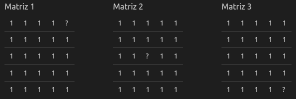
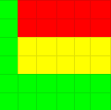
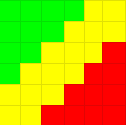

# DFS (Depth-first search) e BFS (Breadth-first search)

 

# OBJETIVOS

Foi proposto pelo professor Michel Pires, na disciplina de Algoritmo e Estrutura de Dados I, a criação de um Algoritmo
que percorre uma matriz de forma aleatória, depois utilizando o bfs e por fim utilizando o dfs. 
Esse algoritmo visa ler uma ou matriz do arquivo input.data, localizado na pasta dataset, e a partir disso, seguir um 
percurso até encontrar o caracter '?' ou explorar toda a matriz.

Dessa forma, após a conclusão do projeto, temos um algoritmo capaz de:

<b>- [✔️] Ler o arquivo input.data, gerado automaticamente pelo programa
<a href= https://github.com/mpiress/GenerateDataToMaze> GenerateDataToMaze </a>;<br></b>
<b>- [✔️] Carregar a matrize na memória;<br></b>
<b>- [✔️] Realizar o andamento da matriz de forma aleatória;</br></b>
<b>- [✔️] Realizar o andamento da matriz por meio do método BFS;</br></b>
<b>- [✔️] Realizar o andamento da matriz por meio do método DFS;</br></b>
<b>- [✔️] Imprimir a tempo necessário para percorrer a matriz utilizando cada um dos métodos acima"; <br></b>

# INTRODUÇÃO

### BFS
O BFS é um algoritmo utilizado principalmente na teoria dos grafos para percorrer um grafo de maneira organizada. Nele, a partir de um nó inicial, o algoritmo visita todos os nós conectados a ele e depois todos os nós conectados aos nós previamente visitados, assim em diante,
até encontrar o nó desejado ou percorrer todos os nós do grafo.

O método pode ser melhor observado no gif abaixo:

<p align="center">

</p>

### DFS

O Depth-First Search (DFS), que significa Busca em Profundidade, é um algoritmo utilizado para percorrer estruturas de dados como grafos, árvores, entre outros. O funcionamento básico do algoritmo é o seguinte: a partir de um nó inicial, o objetivo é explorar o maior número possível de nós em uma determinada direção. Ao atingir um ponto em que não há mais nós a serem explorados nessa direção, o algoritmo retorna ao nó anterior e busca por novos nós não explorados. No caso, esse processo é repetido até que não haja mais nenhum nó a ser explorado.

O método pode ser melhor observado no gif abaixo:

<p align="center">

</p>

### Randômico
Já no método randômico, dado um nó inicial, o computador irá escolher de forma *pseudo aleatória* o proximo nó a ser
explorado, até que todos os nós tenham sido explorados. 

# LÓGICA UTILIZADA

## Primeiros Passos:
Toda a implementação do BFS foi feita em uma classe chamada [bfs](https://github.com/CesarHRS/DFS-e-BFS/blob/main/src/bfs.hpp), sendo que ela tem como atributos: **tam** (que contem o tamanho da matriz), **l** (que contem a linha) e **c** (que contem a coluna), uma **fila** que armazena os nós estão conectados ao nó atual e uma **matriz** (nx2), que armazena os nós que já foram andados.

A maior diferença entre a classe [bfs](https://github.com/CesarHRS/DFS-e-BFS/blob/main/src/bfs.hpp) e a classe [dfs](https://github.com/CesarHRS/DFS-e-BFS/blob/main/src/dfs.hpp), onde o DFS foi implementado é que ao invés de ter uma **fila** como atributo, ela tem uma **pilha**.

Já o método aleatório foi implementado pela classe [rms](https://github.com/CesarHRS/DFS-e-BFS/blob/main/src/rms.hpp), que possui os mesmos atributos que a classe [dfs](https://github.com/CesarHRS/DFS-e-BFS/blob/main/src/dfs.hpp)

## Movimentação:

É válido ressaltar que sempre, antes de se movimentar, são validados os possíveis nós que poderão ser explorados.
* Sempre que um nó é explorado, ele é mercado com um '#'
* Quando um perigo é encontrado:
    * Sua posição é marcada com '1', eliminando-o e BFS começa novamente da posição (0,0)
* Se a posição explorada possuir o cacacter '?' o processo chega ao fim.
* No caso do DFS e o método aleatório, há uma pilha que contém todos nós que podem ser explorados, já no BFS essa função é feita por uma fila.
    * A escolha entre utilizar uma pilha ou uma fila depende da natureza dos métodos utilizados.
        *  Por exemplo, ao implementar o algoritmo DFS, é mais natural pensar em utilizar uma pilha em vez de uma fila. Isso ocorre porque, durante a execução do DFS, quando o algoritmo alcança um ponto em que não há mais nós a serem explorados em uma determinada direção, ele precisa retroceder para o nó anterior. Essa ação de retroceder é semelhante à operação de remover um elemento do topo de uma pilha. 
        * Já na implementação do algoritmo do BFS é mais fácil pensar na implementação utilizando uma fila, pois o primeiro a ser inserido na lista de posições a serem exploradas, também será o primeiro a ser explorado.


# Comparação do número de passos

Para analisar o número de passos iremos utilizar 3 matrizes 5x5 com nosso objetivo "?" posicionado em posições diferentes, visando se aproximar de melhores ou piores casos para cada algoritmo.

<p align="center">

</p>

## Randômico

Como o caminho randômico não tem um comportamento esperado ou definido em cada execução o número de passos pode variar. Então é possível que o ocorra o melhor caminho (indo direto ao objetivo), o pior (percorrendo todas as casas) ou qualquer caminho entre esses.

## Profundidade 

Baseado na ordem de prioridade escolhida nossa busca em profundidade irá apresentar melhores resultados quando o objetivo se encontra na primeira coluna da matriz ou na região inferior.

<p align="center">

</p>
<p align="center"> Figura 1: mapa de regiões dfs (verde: bom, amarelo: médio, vermelho: ruim) </p>

Resultados para as três matrizes utilizadas no teste.

**Matriz 1:** 24 passos </br>
**Matriz 2:** 15 passos </br>
**Matriz 3:** 9 passos </br>

## Largura

Já o método em largura apresenta melhores resultados no "triângulo" a esquerda formado ao traçar uma linha imaginária na diagonal secundária da matriz.

<p align="center">

</p>
<p align="center"> Figura 2: mapa de regiões bfs (verde: bom, amarelo: médio, vermelho: ruim) </p>

Resultados para as três matrizes utilizadas no teste.

**Matriz 1:** 10 passos </br>
**Matriz 2:** 12 passos </br>
**Matriz 3:** 24 passos </br>


### Diferenças entre o BFS e o DFS

Já no BFS, a movimentação é feita pela diagonal, começando de cima para baixo
* Se válido, ir para cima
* Se válido, ir para esquerda
* Se válido, ir para direita
* Se válido, ir para baixo

Durante a movimentação, o DFS segue a seguinte prioridade:
* Vá para baixo, até que não seja mais possível;
* Vá para direita, até que não seja mais possível;
* Vá para esquerda, até que não seja mais possível;
* Vá para cima, até que não seja mais possível;

## Imprimindo resultados:

* No fim de cada método, será impresso o tempo de execução (medido em milisegundos) do método em questão.
* Toda a memória utilizada é devolvida de volta ao Sistema Operacional e o arquivo fechado.

# BIBLIOTECAS

Para o funcionamento desejado, é necessário incluir as seguintes bibliotecas no programa:

<ul>
  <li><code>#include 'iomanip'  </code></li>
  <li><code>#include 'utility'</code></li>
  <li><code>#include 'vector'</code></li>
  <li><code>#include 'random'  </code></li>
  <li><code>#include 'iostream'  </code></li>
  <li><code>#include 'fstream'</code></li>
  <li><code>#include 'chrono'</code></li>
</ul>

* A biblioteca iomanip foi utilizada para definir a precisão dos números após a vírgula com a função setprecision;
* A biblioteca utility foi incluída para utilizar a estrutura **pair**;
* A biblioteca vector foi usada para criar vetores utilizando a estrutura **vector**;
* A biblioteca random foi incluída para gerar números aleatórios;
* A biblioteca iostream é utilizada para as operações de entrada e saída;
* A biblioteca fstream foi incluída para ler o arquivo 'input.data';
* Por fim, a biblioteca chrono foi utilizada para medir o tempo de execução do programa.

# EXEMPLO

O computador usado para a realização do teste foi o seguinte:

| SO                | CPU               | RAM                |
|-------------------|-------------------|--------------------|
| Pop!_OS 22.04 LTS | i7 11800H (Stock) | 2x8GB 3200MTs CL22 |

Tendo o seguinte [input.data](https://github.com/CesarHRS/DFS-e-BFS/blob/main/dataset/input.data) como entrada:

```
Tempo de execução do método randômico:          2598.5662071 ms
Tempo de execução da busca em largura:          739.3519743 ms
Tempo de execução da busca em profundidade:     85.8617586 ms
```
Observação: É válido ressaltar que esses tempos foram a média de 10 testes. Também é bom dizer que o tempo de execução irá variar em função de seu **Hardware** e **Sistema Operacional** e que diferentes entradas resultaram em diferentes resultados, por exemplo, se o arquivo [input.data](https://github.com/CesarHRS/DFS-e-BFS/blob/main/dataset/input.data) conter uma matriz 100 por 100, o programa tende a rodar de forma mais lenta.

# COMPILAÇÃO, EXECUÇÃO E INSTRUÇÔES DE USO

Antes de compilar o programa, lembre-se de colocar o aruivo input.data dentro da pasta dataset.

A algorítmo disponibilizado possui um arquivo Makefile que realiza todo o procedimento de compilação e execução. Para
tanto, temos as seguintes diretrizes de execução:

| Comando      | Função                                                                                   |
|--------------|------------------------------------------------------------------------------------------|
| `make clean` | Apaga a última compilação realizada contida na pasta build                               |
| `make`       | Executa a compilação do programa utilizando o gcc, e o resultado vai para a pasta build. |
| `make run`   | Executa o programa da pasta build após o programa já estar compilado                     |

Portanto, basta rodar o comando <code>make</code>, em um terminal, para compilar o programa e depois o comando <code>
make run</code> para o executar.

# REFERÊNCIAS

* https://cplusplus.com/reference/iomanip/ acessado em:23 de maio de 2023
* https://cplusplus.com/reference/utility/ acessado em:23 de maio de 2023
* https://cplusplus.com/reference/vector acessado em:23 de maio de 2023
* https://cplusplus.com/reference/random/ acessado em:23 de maio de 2023
* https://cplusplus.com/reference/iostream/ acessado em:23 de maio de 2023
* https://cplusplus.com/reference/fstream/ acessado em:23 de maio de 2023
* https://cplusplus.com/reference/chrono/ acessado em:23 de maio de 2023
* ZIVIANI, N. Projeto De Algoritmos Com Implementações Em Pascal E C. 3. ed. São Paulo: Cengage Learning, 2011

# AUTOR

Criado por César Henrique Resende Soares e Vinicius Alves Pereira;

Alunos do 3° periodo do curso de `Engenharia da Computação` no [CEFET-MG](https://www.cefetmg.br)
