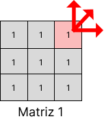
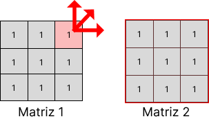
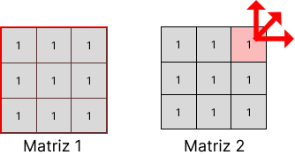
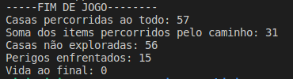
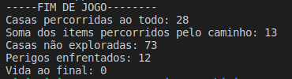
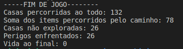

# AEDS - Labirinto Recorrente

### Introdução

Foi proposto desenvolver um jogo seguindo o seguinte contexto:

Um garoto se encontra perdido em um labirinto, o qual é compreendido por nós como sendo uma matriz cuja posição de sua localização é dada por um valor x,y dessa estrutura. Nesse labirinto há paredes que bloqueiam certos passos (#), perigos que consomem parte de sua vida (*) e trajetórias (valores inteiros positivos que devem ser subtraídos em 1 a cada passagem).

Nosso objetivo é desenvolver um algoritmo que ajude o garoto a caminhar por essa matriz, porém, de maneira aleatória. O jogo se encerra em dois casos: A vida do garoto acaba, após passar por vários perigos, ou o garoto consegue voltar para a posição inicial sem coletar nenhum item e passando ao menos 1 vez por cada matriz. 

### Solução

Para cada passo é gerado um número aleatório de 1 a 8, representando o possível próximo movimento. Caso a posição gerada esteja fora dos limites da matriz ocorre um teletransporte.

Esse teleporte leva o personagem para uma posição aleatória em uma outra matriz. Essa matriz é escolhida da seguinte forma:

- Ao tentar sair da matriz por cima, pelas diagonais a esquerda da posição ou pela esquerda, o personagem irá para a matriz anterior
- Já ao tentar sair da matriz por baixo, pelas diagonais a direita da posição ou pela direita, o personagem irá para a próxima matriz

Caso nosso marcador esteja na primeira matriz e tente voltar para a matriz anterior o programa levara o personagem para a última matriz. Além disos, no caso do marcador estando na última matriz, quando ele tentar ir para próxima o programa irá leva-lo para a primeira. 

Caso o programa tenha apenas uma matriz, ao tentar sair por qualquer umas bordas o personagem vai para uma posição aleatória na mesma matriz.

**Observação:** Para todas movimentações, seja um passo ou um teleporte, é sempre validado se o destino é uma posição válida (item ou perigo). Caso isso não aconteça, é gerado novamente enquanto a posição não for válida.

Após realizar um movimento são realizadas as ações. Caso seja perigo, a vida decresce e é verificado se o personagem morreu (vida chegou a zero). Caso seja um item, e esse diferente de zero, o valor é somado na mochila e subtraído na posição da matriz. Além disso, existe uma varável booleana responsável por controlar se foi encontrado algum item.

A mochila representa os itens coletados pelo usuário. Cada posição diferente de 0 gera um incremento em uma variável inteira. Quando esse valor alcança 4, o garoto recebe mais uma vida (se sua vida for menor que 10, a vida inicial) e a contagem é reiniciada.

Para controlar se foi coletado algum item durante o caminho inicializamos uma variável boolean em falso. Durante a execução do programa se for encontrado um valor diferente de zero essa variável é atribuída com verdadeiro. Ou seja, no fim da execução caso a variável ainda seja falsa, não foi coletado nenhum item.

### Implementação

As informações necessárias para a execução são lidas de um arquivo de entrada (input.data). Nele estão o tamanho das matrizes (linhas e colunas), o número de matrizes e, em sequência, as matrizes separadas por uma linha em branco. A posição inicial, linha e coluna, é digita pelo usuário no terminal. O programa considera como matriz inicial sempre a primeira.

Ao inicio do programa as matrizes são lidas do arquivo de entrada e salvas em arquivos separados, cada matriz em um arquivo.

Além disso, a primeira matriz é carregada de dentro do arquivo e é verificado se a posição inicial é válida.

Para o movimento, o número aleatório é tratado um switch-case, com a informações apresentadas na imagem. Para cada valor é verificado se é possível o movimento ou é necessário um teletransporte.

```tsx
Número aleatório / Possível posição
1 - Diagonal superior esquerda ou Matriz anterior
2 - Cima ou Matriz anterior
3 - Diagonal superior direita ou Matriz anterior
4 - Esquerda ou Matriz anterior
5 - Direita ou Proxima matriz
6 - Diagonal inferior esquerda ou Proxima matriz
7 - Baixo ou Proxima matriz
8 - Diagonal inferior direita ou Proxima matriz
```

Sendo possível movimentar, é verificado se a posição destino é diferente de parede. Na situação onde é necessário teleportar são feitos 3 procedimentos: salvar o estado da matriz atual, carregar o estado da outra matriz e, finalmente, gerar uma posição aleatória válida dentro da matriz destino.  

Esses procedimentos são repetidos durante toda execução. Existem duas situações onde o programa encerra: ao zerar a vida do personagem ou percorrer um caminho vazio.

Percorrer um caminho vazio significa sair de uma posição inicial, passar ao menos uma vez por cada uma das matrizes e voltar a posição inicial. Porém, sem coletar nenhum item, ou seja, passar apenas por casas com valor zero.

### Exemplos de Teleporte

Estando o personagem na posição $a_{02}$ da matriz 1 ao tentar sair da matriz por cima, diagonal superior direita ou pela direita, ele será teletransportado para uma posição aleátoria na mesma matriz, visto que, não há outras matrizes.



Em outro caso, ao estar na mesma posição e tentar o mesmo movimento ele irá para a próxima matriz, no caso a matriz 2.



Mas, ao tentar o mesmo movimento estando na última matriz ele será direcionado para a primeira. Nessa situação a matriz 1.



### Review

Ao fim da execução é necessário exibir algumas estatísticas.

- Total de casas percorridas;
- Soma de todos os itens coletados pelo caminho;
- Casas não exploradas;
- Total de perigos enfrentados;
- Vida ao final;

A analisar as casas não exploradas fui necessário a criação de arquivos booleanos auxiliares. Existe um arquivo desse para cada matriz, onde cada posição contém um 0 se a posição não foi acessada e 1 se a posição já foi acessada.

Ao trocar de matriz e ao fim do programa, o arquivo da é atualizado. E durante a o calculo das estatísticas esses arquivos são lidos.

### Trabalhando com arquivos

Foi decido nesse tratado utilizar uma classe File para implementar todas as operações com arquivos.

- Ler dados do arquivo de entrada (input.data);
- Salvar as matrizes em arquivos separados;
- Carregar uma matriz de um arquivo;
- Salvar uma matriz em um arquivo;
- Gerar o arquivo de saída (output.data);

Todos esse procedimentos foram feitos utilizando a biblioteca fstream.

### Números aleatórios

Para a gerar os números aleatórios foi utilizada a biblioteca random.

Esse biblioteca implementa um algoritmo muito utilizado em diversas linguagens de programação, o gerador [Mersenne Twister](http://www.augustobaffa.pro.br/wiki/Gerador_Aleatório_Mersenne_Twister).

```cpp
int Maze::randomInteger(int min, int max) {
    std::random_device rd;
    std::mt19937 gen(rd());
    std::uniform_int_distribution<> dis(min, max);

    return dis(gen);
}
```

### Exemplos

Abaixo seguem alguns exemplos de execução.

No arquivo de entrada foram utilizadas 3 matrizes de tamanho 6 por 6, com valores gerados aleatoriamente.







### Custo Computacional

Como esse é um programa que toma decisões utilizando valores aleatórios, torna-se inviável calcular seu custo computacional. É possível analisar, supondo algumas hipóteses. Qual o custo se andarmo apenas na direita? Ou se andarmos sempre na diagonal?. Mas, analisar o custo do programa como um todo não é possível.

### Conclusão

O algoritmo aleatório tornou possível a solução do problema, porém apresentando alguns pontos negativos. Entre eles a dificuldade de validar a solução, visto que como em cada execução temos diferentes respostas, não há uma solução esperada. Além disso, a impossibilidade de se analisar o custo torna mais difícil pensar em possíveis otimizações sem remover ou alterar a aleatoriedade do problema.

Em relação ao resultados do jogo é possível notar que com um maior número de matrizes na entrada a probalidade de se vencer é menor, visto que é necessário passar por todas as matrizes oque acaba levando ao um contato com uma maior quantidade de perigos.

# Compilação e Execução

A estrutura árvore disponibilizada possui um arquivo Makefile que realiza todo o procedimento de compilação e execução. Para tanto, temos as seguintes diretrizes de execução:

| Comando | Função |
| --- | --- |
| make clean | Apaga a última compilação realizada contida na pasta build |
| make | Executa a compilação do programa utilizando o gcc, e o resultado vai para a pasta build |
| make run | Executa o programa da pasta build após a realização da compilação |

# Contatos

<div style="display: inline-block;">
<a href="https://t.me/vini_apereira">
 
</a>

<a href="https://www.linkedin.com/in/vinicius-alves-pereira-913254236/">

</a>

</div>

<p> </p>


<a style="color:black" href="mailto:vinicius.apereira04@gmail.com?subject=[GitHub]%20Source%20Dynamic%20Lists">
✉️ <i>vinicius.apereira04@gmail.com</i>
</a>